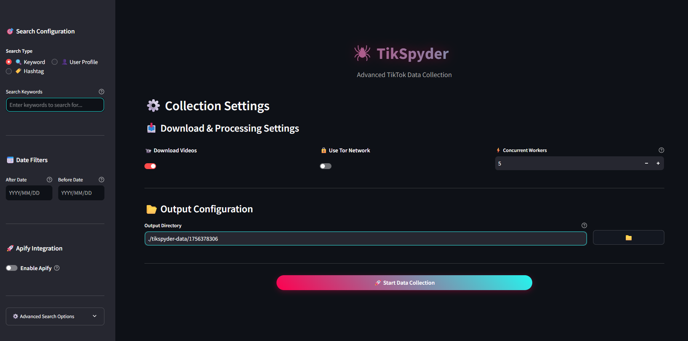

<div align="center">

# **TikSpyder**

</div>

<br />

`TikSpyder` is a command-line tool designed to collect TikTok data using SerpAPI for Google search results and Apify for TikTok data extraction. The tool supports video downloading via yt-dlp and uses Python's asynchronous capabilities and multithreading for efficient data collection.

<br />
<br />

<div align="center">

[](https://GitHub.com/estebanpdl/tik-spyder/network/)
[](https://github.com/estebanpdl/tik-spyder/stargazers)
[](https://x.com/estebanpdl)
[](https://www.python.org/)
[](https://x.com/estebanpdl)
[](https://buymeacoffee.com/estebanpdl)

</div>

<hr />

## 🔧 **Companion Tools**

| Tool | Description | Access |
|------|-------------|--------|
| 🎙️ Audio Transcription | Transcribe audio files from TikTok videos | [](https://colab.research.google.com/drive/1qMcMsS2YI9btXGfFN1sCviQeB7RSKqUH) |

<br />

## 🖥️ **User Interface Options**

TikSpyder provides **two ways** to interact with the tool:

### **1. 🎨 Streamlit Web Interface (Recommended for Non-Technical Users)**
A modern, user-friendly web interface with TikTok-inspired dark theme that makes data collection accessible to everyone.



**Features:**
- 🎯 **Intuitive Configuration**: Easy search setup with tabbed interface for keywords, users, or hashtags
- 📅 **Visual Date Filters**: Calendar widgets for precise date range selection  
- 🚀 **Apify Integration**: Simple toggle to enable enhanced data collection
- ⚙️ **Advanced Options**: Collapsible section for Google search parameters
- 📥 **Download Settings**: Visual controls for video downloads and Tor network usage
- 📂 **File Browser**: Point-and-click directory selection
- 📊 **Real-time Progress**: Live progress tracking with step-by-step status updates

**Launch the Interface:**

**Method 1 (Recommended):**
```sh
# Using package installation
tikspyder --app

# Using standard installation  
python main.py --app
```

**Method 2 (Direct):**
```sh
streamlit run app.py
```

### **2. ⌨️ Command Line Interface (For Advanced Users)**
Full-featured command-line tool for automation and scripting scenarios.

## 🔍 **Description**

TikSpyder offers two main methods of data collection:
1. **Google Search Results**: Using SerpAPI to find TikTok videos based on search queries
2. **Apify Data collection**: Using Apify to collect videos directly from TikTok profiles or keywords

The tool supports various filtering options, including date ranges and content types, and can download both videos and thumbnails. Data is stored in a SQLite database and can be exported to CSV files for further analysis.

Given the dynamic nature of search results and the constantly evolving landscape of TikTok's platform, it's important to note that the data collected by TikSpyder represents a sample rather than a comprehensive dataset. However, this sample can still be valuable for monitoring trends and identifying emerging narratives in the information ecosystem.

To get the most out of TikSpyder, **it is recommended to test your query using Google's advanced search features. This can help refine your search query, improve the relevance of your results, and test specific keywords more effectively**. By taking advantage of these features, you can ensure that you're collecting the most relevant data for your research or analysis.

<br />

## 🚀 **Features**

### **Core Functionality**
- 🔍 Collects TikTok video links using SerpAPI and Apify
- 🖼️ Collects and downloads thumbnails for TikTok videos  
- 🔗 Collects related content to the search query
- 💾 Stores collected data in SQLite database
- 📊 Exports data to CSV files for analysis
- 📹 Downloads TikTok videos using yt-dlp
- 🎞️ Extracts keyframes from downloaded videos
- ⚡ Supports asynchronous and multithreaded downloading for improved performance
- 🔒 Supports Tor network for enhanced privacy and rate limiting avoidance

### **User Interfaces**
- 🎨 **Modern Streamlit Web Interface**: User-friendly GUI with TikTok-inspired dark theme
- ⌨️ **Command Line Interface**: Full-featured CLI for automation and advanced users
- 🎯 **Search Types**: Support for keywords, user profiles, and hashtag searches
- 📅 **Date Range Filtering**: Precise temporal data collection controls

<br />

## ⚙️ **Requirements**

### **System Requirements**
- [Python](https://www.python.org/) >= 3.11.7
- [ffmpeg](https://ffmpeg.org/) (for video processing and keyframe extraction)

### **API Keys & Services**  
- [SerpAPI key](https://serpapi.com/) (required for Google search functionality)
- [Apify API token](https://apify.com/) (optional, for direct TikTok profile scraping)

### **Optional Components**
- [Tor Browser](https://www.torproject.org/) (optional, for enhanced privacy during downloads)

### **Platform-Specific Requirements**
- **All Platforms**: Python libraries listed in `requirements.txt`
- **Streamlit Interface**: Automatically installed with requirements
- **Linux Users**: For GUI components, install tkinter: `sudo apt-get install python3-tk` (Ubuntu/Debian)

<br />

## 🔧 **Installation**

### **Method 1: Standard Installation**

1. Clone the repository

```sh
git clone https://github.com/estebanpdl/tik-spyder.git
cd tik-spyder
```

2. Install the required packages

```sh
pip install -r requirements.txt
```

or

```sh
pip3 install -r requirements.txt
```

### **Method 2: Package Installation (Recommended)**

This method installs TikSpyder as a package, making the `tikspyder` command available from anywhere on your system.

1. Clone the repository

```sh
git clone https://github.com/estebanpdl/tik-spyder.git
cd tik-spyder
```

2. Install the package in editable mode

```sh
pip install -e .
```

or

```sh
pip3 install -e .
```

After installation, you can use `tikspyder` directly from any directory instead of `python main.py`.

### **Configuration**

3. Once you obtain an API key from SerpAPI and Apify, populate the config/config.ini file with the described values. Replace `api_key_value` and `apify_token_value` with your API key and token.

```ini

[SerpAPI Key]
api_key = your_serp_api_key

[Apify Token]
apify_token = your_apify_token
```

<br />

## 📚 **Usage**

TikSpyder offers two interface options to suit different user preferences and use cases:

## 🎨 **Streamlit Web Interface Usage**

The Streamlit interface provides an intuitive, visual way to configure and run data collection tasks.

### **Launch the Interface**

```sh
# Navigate to TikSpyder directory
cd tik-spyder

# Launch the Streamlit app
streamlit run app.py
```

The interface will automatically open in your default web browser at `http://localhost:8501`

### **Using the Interface**

1. **🎯 Configure Search**: Choose between keyword, user profile, or hashtag search
2. **📅 Set Date Filters**: Use calendar widgets to define your collection timeframe  
3. **🚀 Enable Apify** (Optional): Toggle for enhanced direct TikTok data collection
4. **⚙️ Adjust Advanced Options**: Fine-tune Google search parameters if needed
5. **📥 Configure Downloads**: Set video download preferences and worker counts
6. **📂 Choose Output Directory**: Select where your data will be saved
7. **🚀 Start Collection**: Click the centered "Start Data Collection" button

---

## ⌨️ **Command Line Interface Usage**

For advanced users and automation scenarios, TikSpyder provides a full-featured CLI.

### **Using Package Installation (Method 2)**

```sh
tikspyder [OPTIONS]
```

### **Using Standard Installation (Method 1)**

```sh
python main.py [OPTIONS]
```

### **Command Line Arguments**

```sh
# Package installation
tikspyder --help

# or
tikspyder -h

# Standard installation
python main.py --help

# or
python main.py -h
```

```
Command Line Arguments.

Help options:
  -h, --help            Show this help message and exit.

SerpAPI options:
  --q                   The search term of phrase for which to retrieve TikTok data.
  --user                Specify a TikTok user to search for videos from.
  --tag                 Specify a TikTok tag to search for videos from.
  --google-domain       Defines the Google domain to use. It defaults to google.com.
  --gl                  Defines the country to use for the search. Two-letter country code.
  --hl                  Defines the language to use for the search. Two-letter language code.
  --cr                  Defines one or multiple countries to limit the search to.
  --safe                Level of filtering for adult content. Options: active (default), off
  --lr                  Defines one or multiple languages to limit the search to.
  --depth               Depth of iterations to follow related content links.

Google advanced search options:
  --before              Limit results to posts published before the specified date. Format: YYYY-MM-DD.
  --after               Limit results to posts published after the specified date. Format: YYYY-MM-DD.

Optional Apify arguments:
  --apify               Specify whether to use Apify integration.
  --oldest-post-date    Filter posts newer than the specified date. Format: YYYY-MM-DD.
  --newest-post-date    Filter posts older than the specified date. Format: YYYY-MM-DD.
  --number-of-results   Specify the number of results to return from Apify. Default: 25

Optional arguments and parameters:
  --app                 Launch the Streamlit web interface instead of using CLI mode.
  --use-tor             Specify whether to use Tor for downloading TikTok videos.
  -d, --download        Specify whether to download TikTok videos from SerpAPI and Apify.
  -w , --max-workers    Specify the maximum number of threads to use for downloading TikTok videos and extracting keyframes.
  -o , --output         Specify output directory path. If not provided, data is saved in the current working directory in a folder named `tikspyder-data`
```

### **Example Usage**

1. Search-based collection:

```sh
# Using package installation (Method 2)
tikspyder --q "F-16 AND Enemy AND (Ukraine OR Russia)" --gl us --hl en --after 2024-02-01 --before 2024-05-31 --output {output_directory}/ --download

# Using standard installation (Method 1)
python main.py --q "F-16 AND Enemy AND (Ukraine OR Russia)" --gl us --hl en --after 2024-02-01 --before 2024-05-31 --output {output_directory}/ --download

# Note: Replace '{output_directory}' with the desired output path.
```

2. Profile-based collection:

```sh
# Using package installation (Method 2)
tikspyder --q Trump --user username --output {output_directory}/ --download --apify --oldest-post-date 2025-01-01

# Using standard installation (Method 1)
python main.py --q Trump --user username --output {output_directory}/ --download --apify --oldest-post-date 2025-01-01

# Note: Replace '{output_directory}' with the desired output path.
```

3. Tag-based collection
```sh
# Using package installation (Method 2)
tikspyder --tag sinaloa --apify --oldest-post-date 2025-08-01 --number-of-results 50 --output {output_directory}/ --download

# Using standard installation (Method 1)
python main.py --tag sinaloa --apify --oldest-post-date 2025-08-01 --number-of-results 50 --output {output_directory}/ --download

# Note: Replace '{output_directory}' with the desired output path.
```

### Tor Integration
You can use Tor network for downloading TikTok videos to enhance privacy and avoid rate limiting. To use this feature:

1. Make sure Tor Browser is installed and running
2. Configure your torrc file with:

```
## Enable SOCKS proxy
SocksPort 9050

## Enable Control Port for IP rotation
ControlPort 9051
CookieAuthentication 1
```

3. Use the `--use-tor` flag when running the script. If Tor connection fails, the script will automatically fall back to a normal connection.


<br />

## ☕ Support

If you find TikSpyder helpful, please consider buying me a coffee to support ongoing development and maintenance. Your donation will help me continue to improve the tool and add new features.

[](https://buymeacoffee.com/estebanpdl)

<br />
